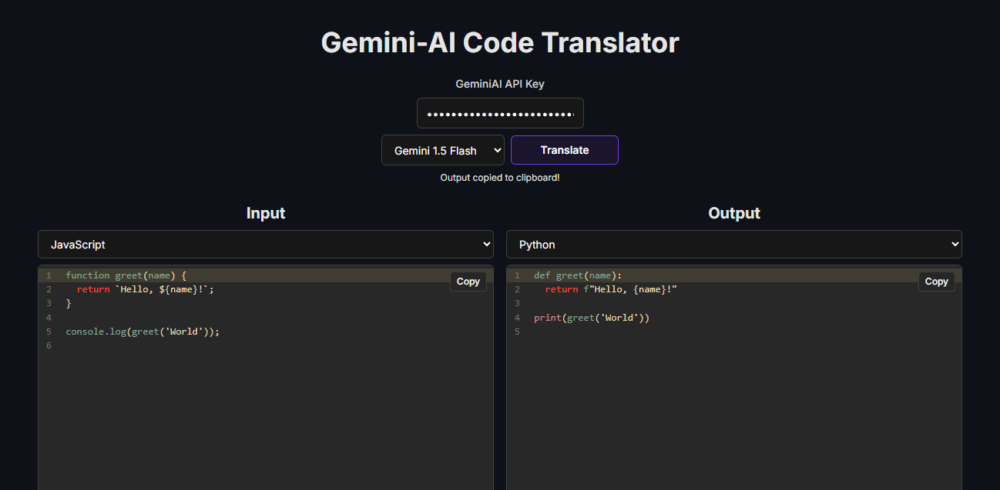

# Gemini AI Code Translator

Use Gemini AI to translate code from one language to another.



## Running Locally

**1. Clone Repo**

```bash
git clone https://github.com/xautiik/ai-code-translator.git
```

**2. Install Dependencies**

```bash
npm i
```
**3. Create .env**

```bash
GEMINI_API_KEY=YOUR_KEY_HERE
```
**4. Run App**

```bash
npm run dev
```
